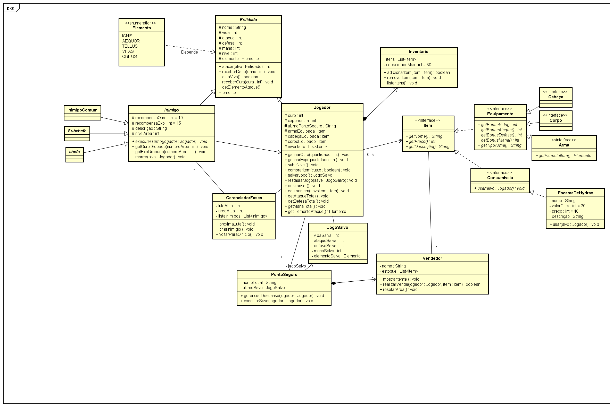

## Projeto RPG: "Skamnos" (Fase Alfa)
Bem-vindo ao repositório do **Skamnos**, um RPG de fantasia desenvolvido em Java focado em mecânicas clássicas de combate e progressão de personagens. O projeto nasceu do interesse em aplicar conceitos avançados de Programação Orientada a Objetos (POO) e organização de sistemas complexos.

**Status do Projeto:** Atualmente em desenvolvimento ativo (Versão Alfa).

## Sobre o Mundo
Skamnos é o nome do mundo onde o jogo se passa, servindo como o alicerce para toda a lore e mecânicas de exploração e sobrevivência.

## Tecnologias Utilizadas
+ **Linguagem:** Java (Foco em POO e Coleções).

+ **Gerenciador de Dependências:** Maven.

+ **Ambiente:** VS Code com Java Extension Pack.

+ **Modelagem:** Diagramas de classe via Astah para planejamento de arquitetura.

## Arquitetura e Organização
O código é estruturado em pacotes para garantir a escalabilidade e facilidade de manutenção:

Para garantir a escalabilidade e organização, o projeto foi planejado utilizando um diagrama de classes. Abaixo está a modelagem inicial do sistema de Entidades, Itens e Motor de jogo:

  

*O diagrama acima reflete a estrutura base do projeto na Fase Alfa.*

+ `com.skamnos.modelo`: Contém as entidades base (`Entidade`, `Jogador`, `Inimigo`, `Elemento`).

+ `com.skamnos.itens`: Interfaces e implementações de equipamentos e consumíveis.

+ `com.skamnos.motor`: Lógica de gerenciamento de fases, combates e sistemas de venda.

## Próximos Passos (Roadmap Alfa)
[x] Estruturação inicial com Maven e Git.

[x] Implementação da lógica base de Entidades e Elementos.

[ ] Finalização da classe `Jogador` e sistema de `Inventário`.

[ ] Implementação do loop de combate para as 36 lutas planejadas.

[ ] Sistema de persistência de dados `(JogoSalvo)`.

## Filosofia de Desenvolvimento
O **Skamnos** não é apenas um código estático; é um ecossistema planejado para expansão contínua. 
* **Evolução:** O diagrama e a implementação atual são bases sólidas, mas flexíveis para mudanças.
* **Longo Prazo:** O foco inicial está na robustez do "core" (motor e modelos) para permitir futuras adições de conteúdo sem retrabalho.
